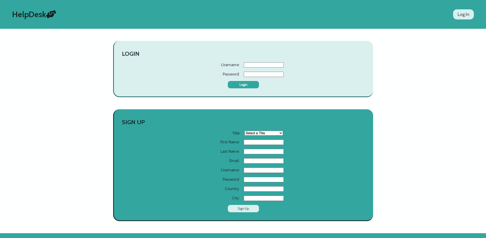
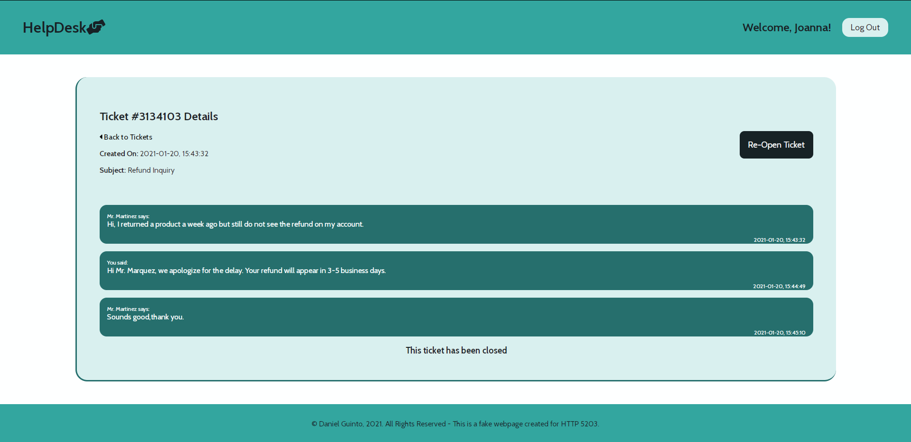

# HelpDesk Ticket Support System

For an XML course, I was required to create an 2 XML files for a support ticket system: one for users and one for tickets. For each XML file, an XML Schema was created to define the structure for each file.

Once those XML files were created and populated with mock data, I was required to use PHP to create a functional support ticket system application using the data from the XML files. This included a login/logout function, displaying of tickets (user specific), ability to create a ticket, respond to tickets, and close/re-open exisiting tickets. PHP DOM methods were used to read and write to the XML files.

## Langauges and Tools Used:

- XML
- PHP (DOM)
- HTML
- CSS

## Notes

This project is for school purposes. User login credentials would not normally be stored and easily accessible in XML files.

MD5 Hashing is used for the sake of the project. Typically, would use password_hash() for better security.

Valid login credentials for the live test can be found at the top of the login.php file. Sign Up feature can also be used for the live test.

## Features to be added:

- List Filtering

## Screenshots

Note: Close/Re-Open ticket button in ticket view is only accesible for admins.
